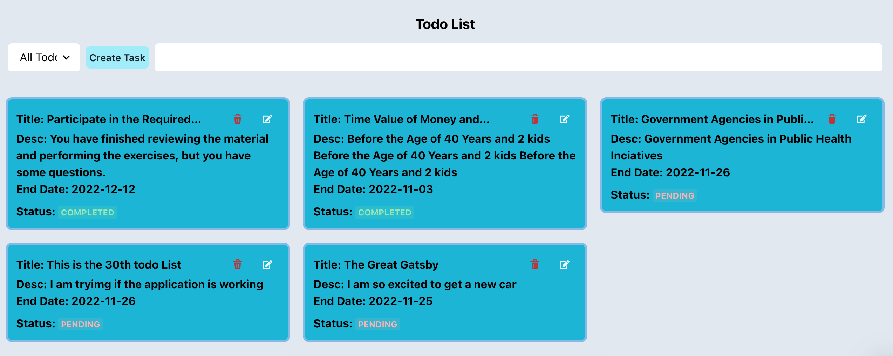

# React Todo App
# Getting Started with Create React Todo App
 

### `npm start`

Runs the app in the development mode.\
Open [http://localhost:3000](http://localhost:3000) to view it in your browser.

The page will reload when you make changes.\
You may also see any lint errors in the console.

###Json server
### `npm run fake-server`

The json server will run at port 3001

"fake-server": "json-server --port=3001 db.json --watch"

  Resources
  http://localhost:3001/todos

  Home
  http://localhost:3001
